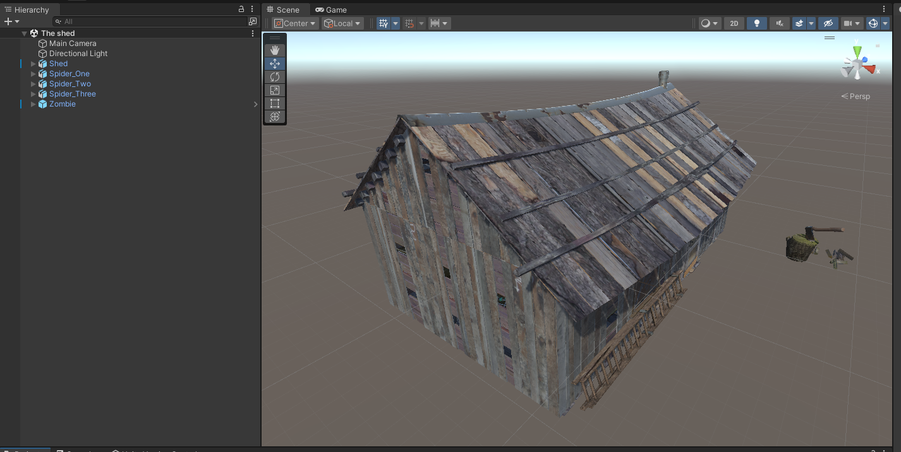
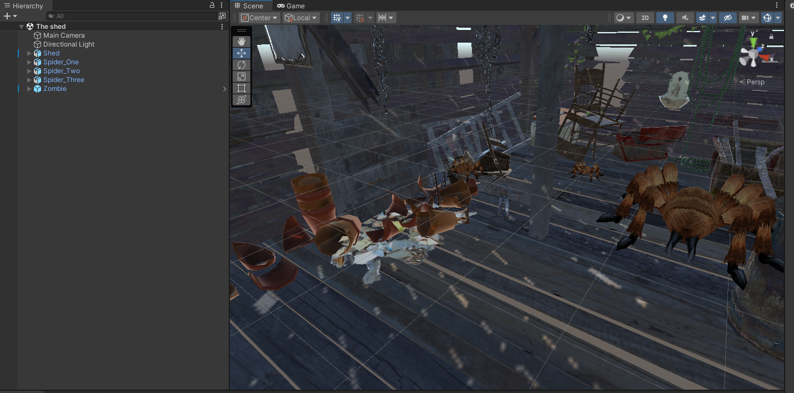
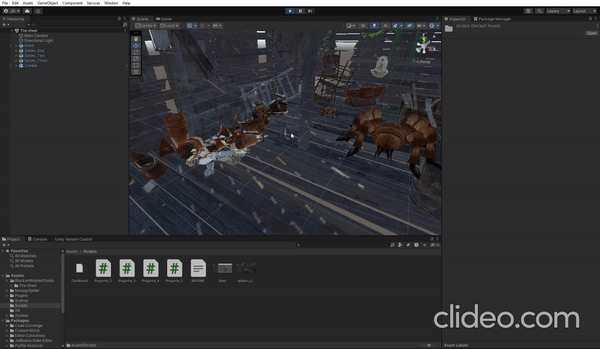
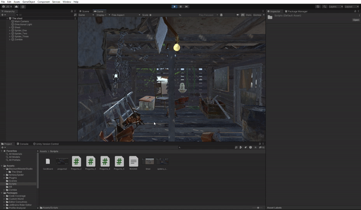
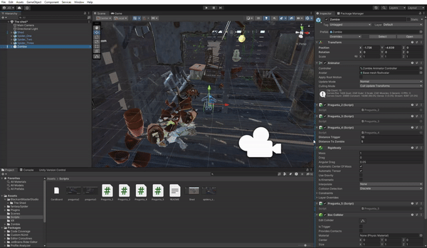
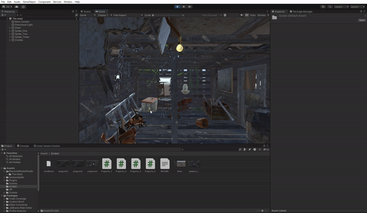

# Examen 1 - Unity

## Pregunta 1 - Incluir paquetes del Asset Store

Descargué los paquetes `The Shed`, `Free Fanatasy Spider` y `Hungry Zombie` del Asset Store.
La escena del `The shed` sirve como eswcena principal, y los prefabs del monstruo y de las areñas se han añadido allí.

## Pregunta 2 - Movimiento del monstruo

Primero (en el mètodo `Start()`) me tomo el monstruo con la ayuda del método `GameObject.Find("Zombie");`.

En cada frame (`Update()`) muevo el monstruo con el método `transform.Translate` y uso `Time.deltaTime` para un movimiento fluido.

## Pregunta 3 - Teletransportacion

Como antes, primero (en el mètodo `Start()`) me tomo el monstruo con la ayuda del método `GameObject.Find("Zombie");`.

En el método `Update()` se comprueba si se imprime la tecla T o no.
Si se pulse, el monstruo está teleportado a una posicion aleatoria.

## Pregunta 4 - Distancia a la pizarra y desplacamiento de las macetas y sillas

En primer lugar, se recuperan de nuevo los objetos en el método `Start()`.

En `Update()` necesito una variable bool `done` si el monstruo está más cerca de la pizzare que el valor de `distance_trigger`.
Tras establecer la variable `done` en True, las sillas se mueven. 

## Pregunta 5 - Collider

El script `Pregunta_5.cs` se ha añadido al zombi y a la silla (con `Add component`).

Para ayudarnos introducimos la variable `near` que indica si el monstruo ya ha colisionado con una silla.
Tenemos el método `OnCollisionEnter`, si el monstruo colisiona con la silla, fijamos la variable `near` en `true`.

En `Update()` movemos las arañas solamente si la variable `near` es `true`.

## Pregunta 6 - Cardboard

Hay la aplicacion de `Cardboard` en el repositorio.

## Pregunta 7 (NO HE FINALIZADO)

No he hecho.

